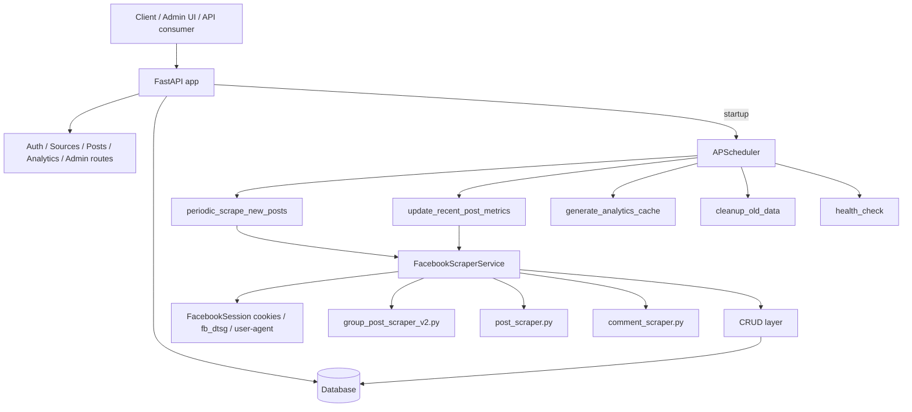
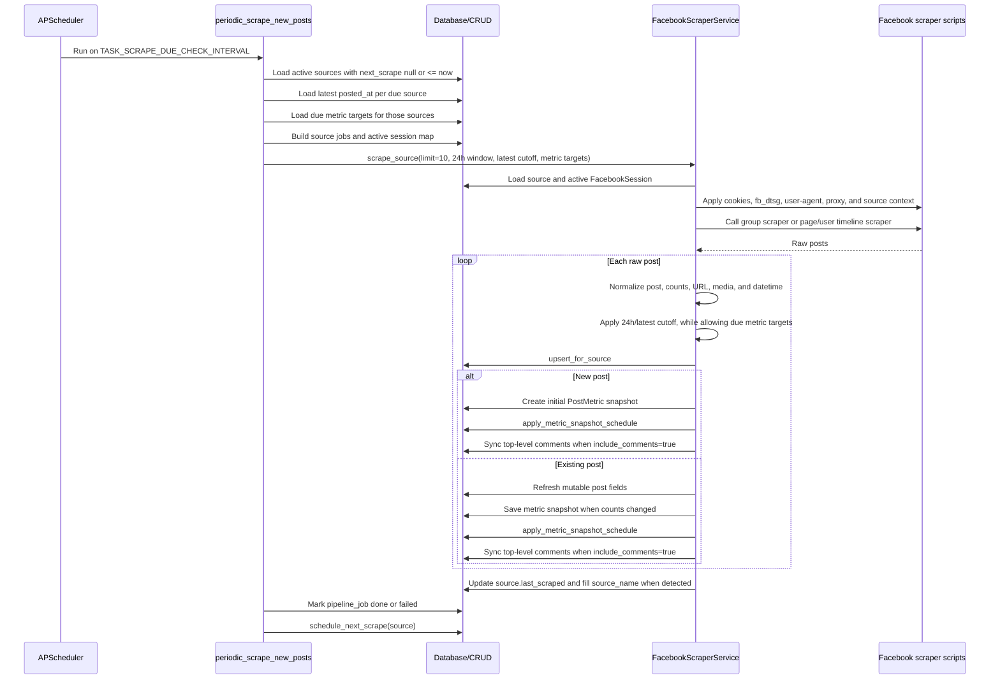
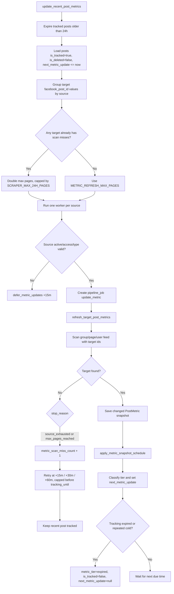
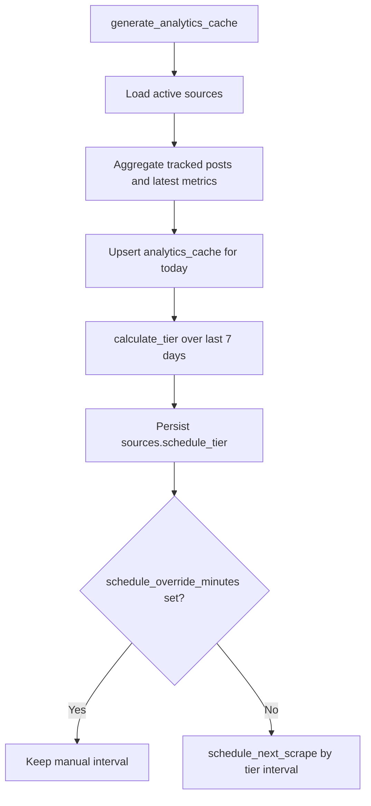
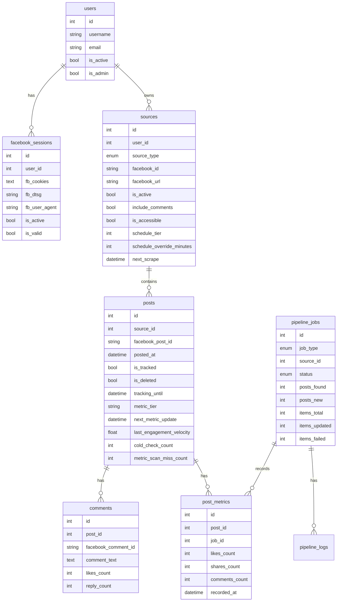

# Project Flow

This document describes the current architecture and main runtime flows of the Facebook Post & Comment Scraper project.

## 1. System Architecture

The system is organized into five main layers:

- **API layer**: `backend/api/main.py` initializes FastAPI, CORS, health checks, the auth/sources/posts/analytics/admin routers, and app startup/shutdown hooks.
- **Scheduler layer**: `backend/scheduler/task_scheduler.py` uses APScheduler to run background tasks on configured intervals.
- **Task orchestration layer**: `backend/scheduler/periodic_tasks.py` selects due sources and due posts, creates pipeline jobs, fans work out to worker threads, and calls the scraper service.
- **Scraper service layer**: `backend/scraper/facebook_service.py` applies Facebook auth context, calls the legacy scraper scripts, normalizes data, upserts posts/comments, writes metric snapshots, and updates per-post metric schedules.
- **Database layer**: SQLAlchemy models and CRUD helpers in `backend/database/` persist users, Facebook sessions, sources, posts, post metrics, comments, analytics cache rows, pipeline jobs, pipeline logs, and task logs.

## 2. New Post Scrape Flow

New post scraping is driven by `periodic_scrape_new_posts`.

Important details:

- Source type `group` uses `group_post_scraper_v2.fetch_posts`.
- Source types `page` and `user` use `post_scraper.fetch_posts`.
- If `facebook_id` is a slug, the service tries to resolve it to a numeric timeline id before scraping page/user timelines.
- New post scraping uses `last_24_hours_only=True`, the latest stored `posted_at` as `min_posted_at`, and `SCRAPER_CONSECUTIVE_OLD_LIMIT`.
- Due metric targets from the same source are passed into the scrape so the scraper can still match and refresh them even when they fall outside the normal new-post cutoff.
- Each scrape source run creates a `pipeline_jobs` row with `job_type="scraper_job"` and attaches related logs/snapshots to that job when possible.

## 3. Metric Update Flow

Metric updates are not based on a fixed interval for all recent posts. Each post owns its next refresh time through `posts.next_metric_update`.

Metric scheduling rules:

- The default tracking window is **24 hours** from `posted_at`.
- `posts.tracking_until` is set from the existing value or `posted_at + 24h`. A post expires when `now >= tracking_until` or when it is older than 24 hours.
- Engagement snapshots are stored in `post_metrics`; `posts.current_likes`, `posts.current_shares`, and `posts.current_comments` are column properties derived from the latest snapshot.
- Weighted engagement is `likes + 3 * comments + 5 * shares`.
- Velocity is weighted engagement growth divided by elapsed hours between the two latest snapshots.
- Source-relative baselines use the latest two snapshots per post from the last 7 days. Percentile tiering only applies when the source has at least 10 velocity samples.
- `bootstrap`: fewer than two snapshots; schedule the next refresh 15 minutes after the latest snapshot.
- `hot`: velocity >= 100, or velocity is positive and >= the source p90 baseline. Refresh intervals are 5 minutes for posts under 2h old, 10 minutes under 6h, then 30 minutes.
- `warm`: velocity >= 20, or velocity is positive and >= the source p70 baseline. Refresh intervals are 15 minutes for posts under 2h old, 30 minutes under 6h, then 60 minutes.
- `cold`: low velocity. The first cold result schedules one 120-minute recheck. If the next successful snapshot is still cold, the post expires early.
- `expired`: the post is no longer tracked and `next_metric_update` is cleared.

Metric miss behavior:

- A scan miss means the target post was not found before the feed was exhausted or before the configured max page limit was reached.
- Misses no longer expire a recent post only because `metric_scan_miss_count` reaches 3.
- Miss retries use backoff intervals of 15, 30, then 60 minutes. Additional misses stay on the 60-minute retry interval.
- Retry time is capped to one minute before the post tracking deadline. If the deadline is already too close, the retry is scheduled immediately.
- Existing active tiers are preserved across misses when the tier is `bootstrap`, `hot`, `warm`, or `cold`; unknown/expired-like tiers are normalized back to `cold` while the post is still inside the tracking window.
- If the post is already outside the tracking window during miss handling, it is expired immediately.
- `backend/tools/recover_recent_metric_misses.py` can recover recent posts that were expired by older miss logic. Dry run prints the recoverable count; `--apply` restores matching posts to `is_tracked=true`, `metric_tier="cold"`, and `next_metric_update=now`.

## 4. Source Schedule and Analytics Flow

Source scrape cadence is separate from per-post metric cadence.

Source tier rules in `backend/services/schedule_service.py`:

- Tier 1, **Hot**: at least 20 posts/day and average likes per post >= 500; interval 30 minutes.
- Tier 2, **Warm**: at least 5 posts/day and average likes per post >= 100; interval 60 minutes.
- Tier 3, **Cool**: at least 3 posts/day; interval 360 minutes.
- Tier 4, **Frozen**: at least 1 post/day or below all higher thresholds; interval 720 minutes.
- When there is no analytics cache data, the suggested tier is unknown and the effective interval falls back to `TASK_SCRAPE_NEW_POSTS_INTERVAL` unless an override exists.
- `schedule_override_minutes` always wins over the calculated tier interval.
- `schedule_next_scrape` only schedules the next scrape. It does not recalculate analytics tiers.
- `apply_analytics_schedule` recalculates and persists the source tier, then reschedules only when no manual override is set.

## 5. Database Flow

Core tables and relationships:

Database behavior during scrape/update:

- `sources.next_scrape` decides which sources are due for new post scraping.
- `sources.schedule_tier` and `sources.schedule_override_minutes` decide how `next_scrape` is calculated.
- `PostCRUD.upsert_for_source` creates a post if missing, otherwise refreshes URL/content/media/posted_at and resets `is_tracked=true`, `is_deleted=false`.
- `PostCRUD.update_metrics` only updates `last_metric_update`; metric counts are stored as rows in `post_metrics`.
- `PostMetricCRUD.create` can attach snapshots to a `pipeline_jobs.id` through `post_metrics.job_id`.
- `apply_metric_snapshot_schedule` updates `metric_tier`, `next_metric_update`, `tracking_until`, `last_engagement_velocity`, `cold_check_count`, and `metric_scan_miss_count`.
- `handle_max_page_misses` increments `metric_scan_miss_count`, keeps recent missed posts tracked with capped retry backoff, and expires posts that have already left the tracking window.
- `comments` are upserted by `facebook_comment_id`; replies are intentionally disabled at runtime, so only top-level comments are synced.
- `pipeline_jobs`, `pipeline_logs`, and `task_logs` record task/job state and operational errors.
- `analytics_cache` is generated by `generate_analytics_cache`; `apply_analytics_schedule` then calculates source tiers and schedules the next scrape when no override exists.

## 6. Important Business Rules

- Only sources with `is_active=true` are processed by scheduler tasks.
- A source with `is_accessible=false` and a non-null `permission_checked_at` is skipped; the next scrape or metric retry is still scheduled.
- Supported source types are `group`, `page`, and `user`; other types are skipped by orchestration or raise `NotImplementedError` in the service.
- Duplicate sources are blocked by unique `(user_id, facebook_id)`.
- `facebook_post_id` is unique in `posts`; avoid introducing cross-source duplicate behavior when changing post identity logic.
- New post scraping only targets posts in the last 24 hours and stops after too many old posts according to `SCRAPER_CONSECUTIVE_OLD_LIMIT`.
- Metric refresh targets only posts whose own `next_metric_update` is due. It does not scan every recent post by default.
- Metric refresh uses `METRIC_REFRESH_MAX_PAGES`; sources with existing scan misses get a wider scan capped by `SCRAPER_MAX_24H_PAGES`.
- Missing metric targets are retried with backoff until the post reaches its tracking deadline. They are not expired just because the miss count reaches three.
- Posts older than 24 hours are untracked/expired and no longer receive metric updates.
- Temporary source/post failures defer metric targets by 15 minutes instead of expiring them immediately.
- Auth context comes from `facebook_sessions`: cookies, `fb_dtsg`, and user-agent. Proxy behavior depends on whether cookies are available.
- `SCRAPER_DOWNLOAD_MEDIA` and `METRIC_REFRESH_DOWNLOAD_MEDIA` default to false to reduce request and I/O cost.

## 7. Common Failure Modes

- **Expired cookies or fb_dtsg**: the scraper may return no posts, fail permission checks, or hit a Facebook login wall.
- **Wrong source id or unresolved slug**: group/page/user scrapers cannot fetch posts; check `facebook_id` and `facebook_url`.
- **Inaccessible source**: scheduler skips the source because `is_accessible=false` after permission checks.
- **Facebook response shape changed**: parsers cannot find post blocks, group feed edges, or timeline edges; inspect `pipeline_logs` diagnostics.
- **Rate limit, blocked IP, or proxy failure**: requests time out, return empty responses, or are blocked; check proxy config and logs.
- **Missing or wrong datetime**: posts may be skipped by 24h filtering; the service falls back to `utcnow()` when normalized datetime is invalid.
- **Metric target not found within scanned pages**: `max_pages_reached` or `source_exhausted` increments miss count and schedules a capped retry.
- **Old miss-expired posts after deploying newer logic**: run `python backend/tools/recover_recent_metric_misses.py` for a dry run, then add `--apply` to recover eligible recent posts.
- **Scheduler overlap or misfire**: APScheduler uses `max_instances=1` and `coalesce=True`; jobs delayed by more than 2 hours can be skipped.
- **SQLite lock or commit race**: workers use separate sessions; high worker counts on SQLite can still produce lock contention.
- **Windows log encoding issues**: `main.py` reconfigures stdout/stderr to UTF-8, but old logs can still render incorrectly if the terminal or file encoding is wrong.

## 8. Checklist When Changing Code

- Identify the flow being changed: API, scheduler, new post scraping, metric updates, database, analytics, or recovery tooling.
- Check the 24h tracking rule, `next_scrape`, `next_metric_update`, `metric_tier`, and miss retry behavior before changing scheduler or metric logic.
- Do not write metric counts directly into `posts`; create a `post_metrics` snapshot and let column properties expose current metrics.
- When changing parser code, keep normalized raw post output compatible: `post_id`, `posted_at`, URL/permalink, reaction/share/comment counts, and media fields.
- When changing source handling, keep support for `group`, `page`, and `user`, including legacy signature fallbacks used by tests/mocks.
- When changing comment sync, remember that replies are intentionally disabled to keep scrape scope smaller.
- When changing DB models or migrations, update `backend/database/models.py`, migrations/schema files, and tests together.
- When changing scheduler code, verify batch limits, max workers, defer paths, miss paths, expiry paths, and pipeline job logging.
- When changing metric tiers, run focused tests in `backend/tests/test_post_metric_schedule.py`.
- Keep operational diagnostics traceable with source id, job id, fetched/updated/skipped counts, target counts, pages scanned, and stop reason.
- Do not revert unrelated working tree changes made by someone else.
- Before merging scheduler/metric changes, run:
  - `python -m pytest backend/tests/test_post_metric_schedule.py`
  - `python -m pytest backend/tests/test_facebook_service.py`
  - `python -m pytest backend/tests/test_posts_trending.py`
  - `python -m py_compile backend/scraper/facebook_service.py backend/scheduler/periodic_tasks.py backend/services/post_metric_schedule_service.py`
